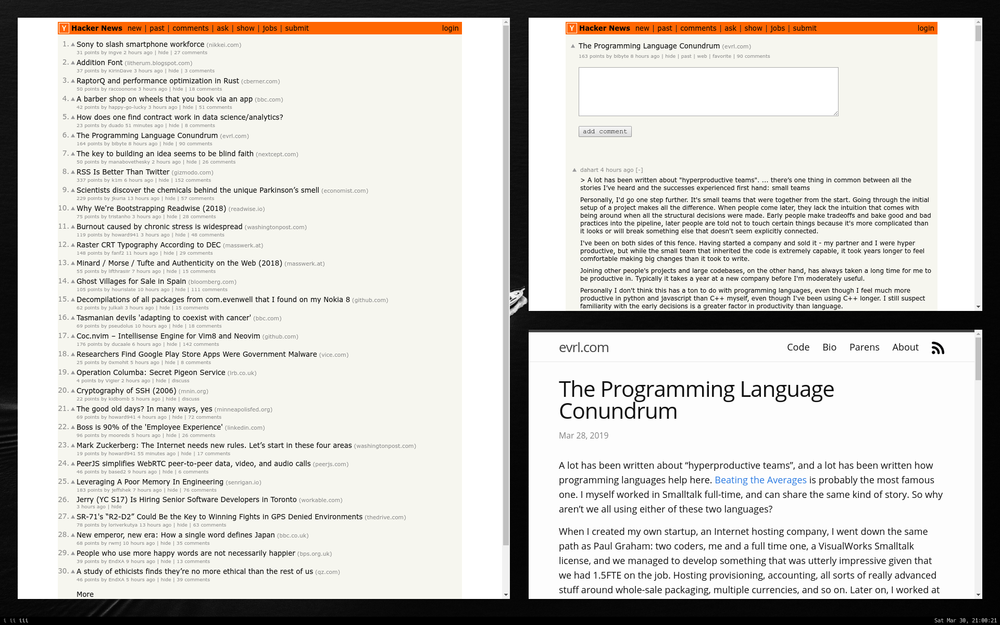

# sheaf

A very simple web browser. Inspired by suckless' [surf](https://surf.suckless.org/), but built on electron. Ironically, this makes it suck a lot from suckless's perspective.

Ideal for when you want a simple browser in a restrictive environment, as this was built to fit on the University of Edinburgh's [DICE](http://computing.help.inf.ed.ac.uk/dice-platform) system.

`sheaf` supports sending pages to Firefox, when you want to use a more fully-featured browser.

## Screenshot



## Installation

```
$ git clone https://github.com/pkage/sheaf
$ cd sheaf
$ npm i
```

Optionally, symlink onto your `$PATH`:
```
$ ln -s `pwd`/run.sh ~/.usr/bin/sheaf
```

## Usage

Open the browser
```
$ sheaf
```

Open a URL
```
$ sheaf https://github.com/pkage
``` 

## Keybindings 

Key | Effect
--- | ---
`Ctrl-Left` | Go back.
`Ctrl-Right` | Go forward.
`Ctrl-R` | Reload the page
`Ctrl-L` | Show the page
`Ctrl-Shift-F` | Send current page to Firefox
`Ctrl-Alt-J` | Show developer tools
`Esc` | Return to page (from URL dialog)
